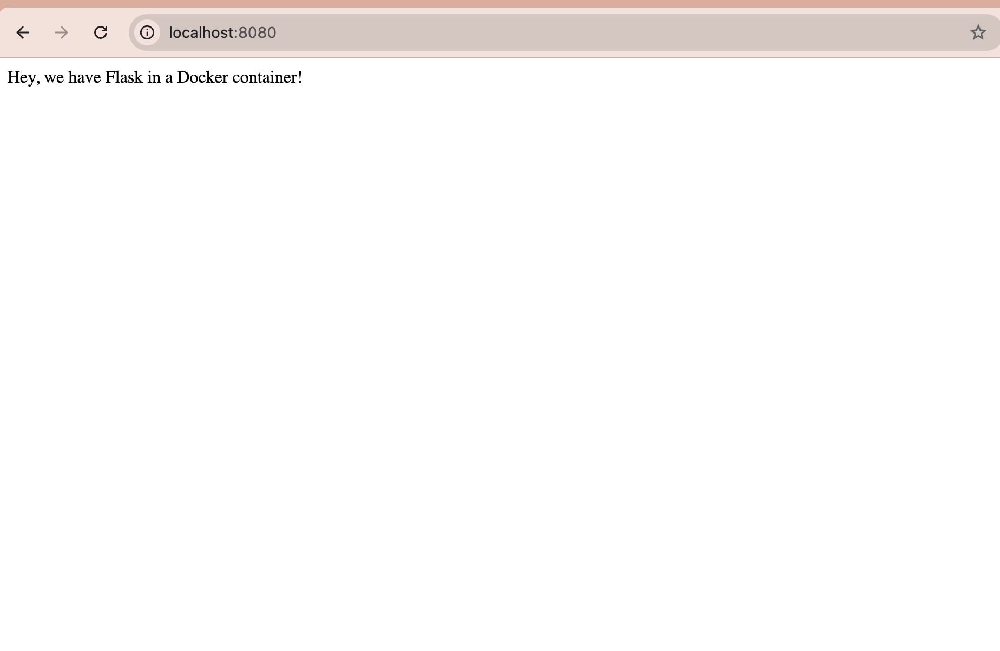

# Docker Flask Web App

A simple Flask web application packaged with Docker and deployed on the CMC lambda server.  
I used rootless Docker and SSH port forwarding to make the webpage viewable locally.

## Screenshot

